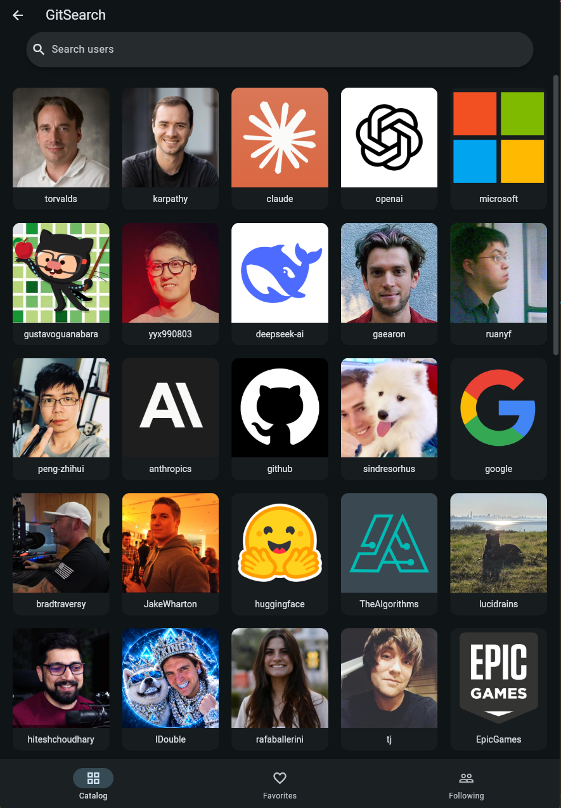

# GitSearch

A Flutter app for browsing and searching GitHub users. It lists the most followed accounts on GitHub, lets you look up any user by login, view their profile and public repositories, and keep a local list of favorites and followed users.



## Features

- Catalog of the most followed GitHub users, paginated with a "Load more" button
- Search for any user by login
- User profile with bio, stats and public repositories
- Favorites and following lists, persisted locally
- Local login screen
- Light and dark theme
- Screen reader labels on images and interactive elements

## Stack

- Flutter 3.x / Dart 3.x
- [http](https://pub.dev/packages/http) for the GitHub REST API
- [provider](https://pub.dev/packages/provider) for state management
- [shared_preferences](https://pub.dev/packages/shared_preferences) for local persistence

## Project structure

```
lib/
  main.dart          app entry, providers and theme
  routes.dart        named routes
  models/            data classes mapped from the GitHub API
  services/          API client, error types, storage contract
  providers/         ChangeNotifier state (auth, favorites, following)
  screens/           one file per screen
  widgets/           shared widgets
test/                unit tests
```

Screens talk to providers, providers talk to services, services talk to the API. Models are immutable and carry `fromJson` / `toJson`.

## Running

```
flutter pub get
flutter run -d chrome
```

Any device works. Android and web are the tested targets.

### GitHub token (optional)

Unauthenticated requests to the GitHub API are limited to 60 per hour per IP. To raise the limit, create a [fine-grained personal access token](https://github.com/settings/personal-access-tokens/new) with no extra permissions and pass it at build time:

```
flutter run -d chrome --dart-define=GITHUB_TOKEN=github_pat_xxx
```

The token is read with `String.fromEnvironment` and never stored in the repository.

## Tests

```
flutter test
```

Service tests use a mocked HTTP client and do not hit the network.

## API

All data comes from the public [GitHub REST API](https://docs.github.com/en/rest). The catalog uses `GET /search/users` filtered by follower count, search and profile use `GET /users/{login}`, and the repository list uses `GET /users/{login}/repos`.
